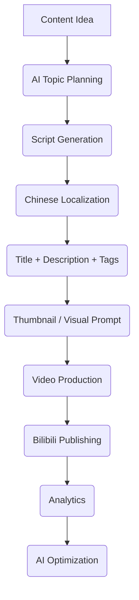

# Bili-Bili: AI-Powered Bilibili Creator Toolkit 🚀

AI-powered Bilibili Creator Toolkit for planning, organizing, and optimizing video content, titles, descriptions, captions, thumbnails, and publishing workflows.

🎬 **Bilibili Creator AI Toolkit**

«Create smarter. Publish better. Grow consistently. 🤖✨»

An AI-powered toolkit designed to help creators plan, prepare, and manage content for Bilibili. This project focuses on transforming a content idea into a structured publishing workflow, encompassing topic research, script generation, title and description optimization, caption creation, thumbnail prompting, and future content analytics.

---

## ✨ Features

- 🤖 **AI Content Assistant**: Generate and refine creative content ideas.
- 📝 **Script Generator**: Create well-structured and engaging video scripts.
- 🇨🇳 **Chinese Content Support**: Prepare localized Chinese titles, descriptions, and relevant hashtags.
- 🎯 **Title Generator**: Craft clear, concise, and click-worthy Bilibili titles.
- 📄 **Description Generator**: Generate organized and informative video descriptions.
- #️⃣ **Hashtag Suggestions**: Discover and apply relevant discovery tags for increased reach.
- 🖼️ **Thumbnail Prompts**: Generate effective prompts for creating compelling thumbnail and cover artwork.
- 🎬 **Video Workflow Management**: Organize ideas, scripts, assets, and publishing tasks efficiently.
- 📊 **Analytics Ready**: Designed with future performance tracking and content insights in mind.
- 🔄 **Automation Ready**: The architecture is built to be extended with APIs and scheduled workflows for seamless integration.

---

## 🧠 Workflow



---

## 🛠️ Tech Stack

- **Frontend**: Next.js, React, TypeScript, Tailwind CSS
- **Backend**: Node.js, API Services, Server-side AI integrations
- **AI**: OpenAI, Anthropic, Google Gemini (Planned)
- **Data**: Firebase / Firestore (Planned)
- **Deployment**: Vercel (Planned)

---

## 📁 Project Structure

```plaintext
bilibili-creator-ai/
├── app/
├── components/
├── services/
├── lib/
├── public/
├── prompts/
├── scripts/
├── docs/
├── .env.example
├── package.json
└── README.md
```

---

## 🚀 Getting Started

### Requirements

- Node.js 20+ 🌳
- npm (Node Package Manager)
- An AI provider API key (e.g., OpenAI)
- Firebase project (if Firebase features are enabled and configured)

### Installation

1.  **Clone the repository:**
    ```bash
    git clone https://github.com/rananisarsb51214/Bili-Bili.git
    cd Bili-Bili
    ```

2.  **Install dependencies:**
    ```bash
    npm install
    ```

3.  **Set up environment variables:**
    Create your local environment file by copying the example:
    ```bash
    cp .env.example .env.local
    ```
    Then, add your required configuration (like AI provider API keys) to the `.env.local` file.

### Development

To start the development server, run:

```bash
npm run dev
```

Open your browser to `http://localhost:3000` (or the port specified in your environment) to begin using the toolkit.

---

## 🔐 Security Best Practices

**Never commit private credentials to your repository.** This includes:

- `.env` files
- `.env.local`, `.env.production`
- `service-account.json`
- AI API keys
- Firebase Admin credentials

Public browser configuration should only include variables explicitly designed for client-side use. AI provider credentials and server-side Firebase credentials must remain securely on the server.

---

## 📌 Roadmap

### Phase 1 — Foundation

- [x] Next.js application setup
- [x] TypeScript integration
- [x] Tailwind CSS styling
- [ ] Creator dashboard
- [ ] Environment configuration handling

### Phase 2 — AI Content Generation

- [ ] AI topic generator
- [ ] Script generator
- [ ] Chinese localization tools
- [ ] Title generator
- [ ] Description generator
- [ ] Hashtag generator

### Phase 3 — Creator Studio

- [ ] Content library management
- [ ] Video project management tools
- [ ] Thumbnail prompt generator
- [ ] Caption management interface
- [ ] Publishing checklist features

### Phase 4 — Analytics Integration

- [ ] Content performance dashboard
- [ ] Engagement tracking
- [ ] Trend analysis tools
- [ ] AI-powered content recommendations

### Phase 5 — Automation & Optimization

- [ ] Scheduled workflow execution
- [ ] Publishing integrations (potential)
- [ ] Content pipeline automation
- [ ] Performance-based optimization suggestions

---

## ⚖️ Platform & API Compliance

This project is an independent creator tool and is **not affiliated with, sponsored by, or endorsed by Bilibili.**

Any future API or publishing integration must utilize officially supported Bilibili developer capabilities and strictly comply with all applicable platform policies and usage requirements. Refer to the official Bilibili Open Platform documentation for guidance on authorization, video management, data access, and other developer services.

---

## 🎯 Vision

**One Creator → One AI Studio → Complete Content Workflow**

The ultimate goal is to empower creators by minimizing the time spent on repetitive preparation tasks, allowing them to focus more on producing high-quality, original, and engaging content.

---

## ⭐ Contributing

Contributions, ideas, improvements, and bug reports are highly welcome! Please keep contributions focused on:

- Enhancing creator productivity 📈
- Streamlining original content workflows ✍️
- Leveraging AI for content production 🤖
- Developing platform-compliant integrations 🔗
- Ensuring security and reliability 🛡️

Feel free to open an issue or submit a pull request.

---

## 📄 License

This project is currently without a specified license. Please choose and add an appropriate open-source license before publishing or distributing the project widely.

---

Built for creators. Powered by AI. 🚀

[Back to Top](#table-of-contents)


---
**<p align="center">Generated by [ReadmeCodeGen](https://www.readmecodegen.com/)</p>**